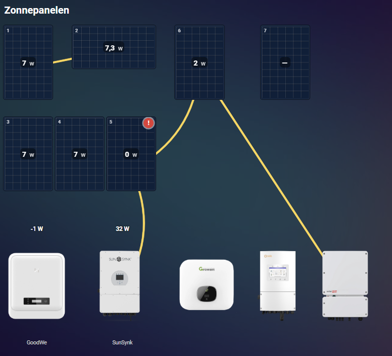
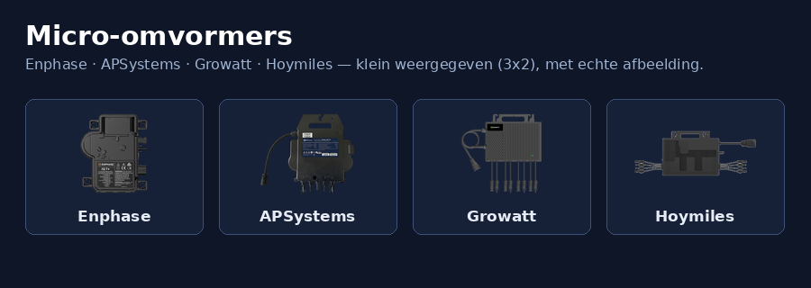

# Solar Layout Card


**English** · [Nederlands](#nederlands)

A Home Assistant Lovelace card that shows a layout of your solar panels, with the
live PV output inside each panel. Panels can be placed portrait or landscape
individually, and you build the layout with a drag-and-drop editor.





## Features
- Layout on a grid, matching how the panels lie on your roof.
- Link a sensor per panel; the value and unit are shown.
- Panels are coloured by their output relative to a Wp reference (configurable per panel).
- Configurable colours: dark when the panel is off, ramping to light blue in strong sun (Enphase style).
- Zoom button to make large arrays more compact (100% down to 40%).
- Type-to-search on the sensor picker and a button to duplicate a panel (keeps sensor, Wp and orientation).
- Adjustable text size, independent of the zoom.
- Multiple layouts via tabs (default Layout1, Layout2, ...); rename via the pencil icon next to the active tab. With a single layout the tabs stay hidden on the card itself.
- Inverters placeable in the layout (GoodWe, SolarEdge, Growatt, Solis, Sunsynk), with an optional sensor.
- Red warning on a panel that reads 0 W during the day (via sun.sun).
- Sleep icon (Zzz) on an inverter when the sun is down and the linked sensor reads 0.
- Inverters shown with a real image (GoodWe, SolarEdge, Growatt, Solis, Sunsynk).
- Connection lines between panels and to the inverter, straight or curved.
- Flowing dots along the connection lines (toggle with the "Moving dots" checkbox in the display options at the top of the editor, or via `flow_dots` in the config).
- History time slider: a clock icon on the card reveals a slider to step back up to 12 hours in 15-minute steps, showing each panel's output at that moment. It returns to live automatically after 30 seconds. This is view-only and never changes your configuration.
- Multilingual: the texts follow the Home Assistant language (`hass.language`). Dutch, German and English are supported; other languages fall back to English.
- Colour configurable per connection line (default amber).
- Micro-inverters placeable alongside the regular inverters (Enphase, APSystems, Growatt, Hoymiles), shown small (3x2 cells) and with a real image.
- Zoom per layout; hide options for inverter image/label/sensor.
- Portrait/landscape per panel.
- Visual editor with dragging and snap-to-grid.
- Clicking a panel opens the more-info dialog of its sensor.

## Installation via HACS
1. HACS, three dots, Custom repositories.
2. Add the repo URL, category Dashboard.
3. Download and reload your browser.

The resource is served via `/hacsfiles/solar-layout-card/solar-layout-card.js`.

## Example configuration
```yaml
type: custom:solar-layout-card
title: Solar panels roof
reference: 400        # default Wp for new panels
color_off: "#0b1f3a"  # dark = off / no sun
color_max: "#6fc3ff"  # light blue = maximum output
zoom: 100             # 40 to 100
font_scale: 100       # text size in percent (50 to 200)
panels:
  - id: a1
    x: 0
    y: 0
    orientation: portrait
    entity: sensor.panel_1_power   # Watt
    wp: 400
    label: "1"
  - id: a2
    x: 4
    y: 0
    orientation: landscape
    entity: sensor.panel_2_power   # Watt
    wp: 370
    label: "2"
```

## Configuration options
| Option      | Type   | Default   | Description |
|-------------|--------|-----------|-------------|
| `title`     | string | `""`      | Title above the card. |
| `reference` | number | `400`     | Default Wp for newly added panels. |
| `color_off` | string | `#0b1f3a` | Colour when off / no output. |
| `color_max` | string | `#6fc3ff` | Colour at maximum output (at Wp). |
| `zoom`      | number | `100`     | Starting zoom in percent (40 to 100). |
| `font_scale`| number | `100`     | Text size in percent (50 to 200). |
| `panels`    | list   | `[]`      | Panels (single layout). |
| `inverters` | list   | `[]`      | Inverters and micro-inverters (single layout). |
| `inv_hide_image` | bool | `false` | Hide the inverter image (all inverters). |
| `inv_hide_label` | bool | `false` | Hide the inverter label. |
| `inv_hide_sensor`| bool | `false` | Hide the inverter sensor value. |
| `flow_dots`  | bool | `true`  | Toggle the moving dots along the connection lines. |
| `connections` | list | `[]`     | Lines between items; each with `from`, `to`, `curved` and `color`. |
| `layouts`   | list   | -         | Multiple layouts; each with `name`, `panels`, `inverters`, `connections`, `zoom`. |

Per panel: `id`, `x`, `y` (grid coordinates), `orientation` (`portrait`/`landscape`),
`entity` (Watt sensor), `wp` (peak power of this panel, for the colour scale), `label`.

Per inverter: `id`, `x`, `y`, `brand`, `entity` (optional), `label`. Set `micro: true` for
a micro-inverter; the brand is then one of `enphase`, `apsystems`, `growatt`, `hoymiles`.
Without `micro` it is a string inverter (`goodwe`, `solaredge`, `growatt`, `solis`, `sunsynk`).

If an inverter has a sensor that reads 0 while the sun is down, a small sleep icon (Zzz)
appears on the inverter. This mirrors the red 0 W warning that panels get during the day.

Per connection: `from`, `to` (panel or inverter `id`), `curved` (straight or curved) and
`color` (line colour, default `#ffd54a`).

## Development
A single `dist/solar-layout-card.js` file, no build step needed.

## License
MIT, see [LICENSE](LICENSE).

---

## Nederlands

[English](#solar-layout-card) · **Nederlands**

Een Home Assistant Lovelace-card die een legplan van je zonnepanelen toont, met de
live PV-opbrengst in elk paneel. Panelen zijn per stuk portrait of landscape
te plaatsen en de indeling maak je met een drag and drop editor.

### Functies
- Legplan op een raster, zoals de panelen op je dak liggen.
- Per paneel een sensor koppelen; waarde en eenheid worden getoond.
- Panelen kleuren mee met de opbrengst ten opzichte van een Wp-referentie (per paneel instelbaar).
- Configureerbare kleuren: donker als het paneel uit is, oplopend naar lichtblauw bij veel zon (Enphase-stijl).
- Zoomknop om grote opstellingen compacter te maken (100% tot 40%).
- Typed zoeken bij de sensorkeuze en een knop om een paneel te dupliceren (neemt sensor, Wp en orientatie mee).
- Instelbare tekstgrootte, los van de zoom.
- Meerdere legplannen via tabbladen (standaard Layout1, Layout2, ...); hernoemen via het potlood-icoon naast het actieve tabblad. Bij een enkel plan blijven de tabbladen op de card zelf verborgen.
- Omvormers plaatsbaar in het legplan (GoodWe, SolarEdge, Growatt, Solis, Sunsynk), met optionele sensor.
- Rode waarschuwing op een paneel dat overdag 0 W meet (via sun.sun).
- Slaap-icoon (Zzz) op een omvormer wanneer de zon onder is en de gekoppelde sensor 0 meet.
- Omvormers met echte afbeelding (GoodWe, SolarEdge, Growatt, Solis, Sunsynk).
- Verbindingslijnen tussen panelen en naar de omvormer, recht of gebogen.
- Stromende bolletjes over de verbindingslijnen (aan/uit te zetten via de checkbox "Bewegende bolletjes" bij de weergave-opties bovenaan de editor, of via `flow_dots` in de config).
- Tijdbalk met historie: een klok-icoontje op de card opent een schuif waarmee je tot 12 uur terug kunt in stappen van 15 minuten, met per paneel de opbrengst van dat moment. Na 30 seconden springt hij automatisch terug naar live. Dit is alleen weergave en verandert je configuratie niet.
- Meertalig: de teksten volgen de taal van Home Assistant (`hass.language`). Ondersteund zijn Nederlands, Duits en Engels; andere talen krijgen automatisch Engels.
- Kleur per verbindingslijn instelbaar (standaard amber).
- Micro-omvormers plaatsbaar naast de gewone omvormers (Enphase, APSystems, Growatt, Hoymiles), klein weergegeven (3x2 cellen) en met echte afbeelding.
- Zoom per legplan; verberg-opties voor omvormer-afbeelding/label/sensor.
- Portrait/landscape per paneel.
- Visuele editor met slepen en snap-to-grid.
- Klik op een paneel opent de more-info dialoog van de sensor.

### Installatie via HACS
1. HACS, drie puntjes, Custom repositories.
2. Voeg de repo-URL toe, categorie Dashboard.
3. Download en herlaad je browser.

De resource wordt geserveerd via `/hacsfiles/solar-layout-card/solar-layout-card.js`.

### Voorbeeldconfiguratie
```yaml
type: custom:solar-layout-card
title: Zonnepanelen dak
reference: 400        # standaard-Wp voor nieuwe panelen
color_off: "#0b1f3a"  # donker = uit / geen zon
color_max: "#6fc3ff"  # lichtblauw = maximale opbrengst
zoom: 100             # 40 t/m 100
font_scale: 100       # tekstgrootte in procent (50 t/m 200)
panels:
  - id: a1
    x: 0
    y: 0
    orientation: portrait
    entity: sensor.paneel_1_vermogen   # Watt
    wp: 400
    label: "1"
  - id: a2
    x: 4
    y: 0
    orientation: landscape
    entity: sensor.paneel_2_vermogen   # Watt
    wp: 370
    label: "2"
```

### Configuratie-opties
| Optie       | Type   | Standaard | Beschrijving |
|-------------|--------|-----------|--------------|
| `title`     | string | `""`      | Titel boven de card. |
| `reference` | number | `400`     | Standaard-Wp voor nieuw toegevoegde panelen. |
| `color_off` | string | `#0b1f3a` | Kleur bij uit / geen opbrengst. |
| `color_max` | string | `#6fc3ff` | Kleur bij maximale opbrengst (bij Wp). |
| `zoom`      | number | `100`     | Startzoom in procent (40 tot 100). |
| `font_scale`| number | `100`     | Tekstgrootte in procent (50 tot 200). |
| `panels`    | list   | `[]`      | Panelen (enkel legplan). |
| `inverters` | list   | `[]`      | Omvormers en micro-omvormers (enkel legplan). |
| `inv_hide_image` | bool | `false` | Verberg de omvormer-afbeelding (alle omvormers). |
| `inv_hide_label` | bool | `false` | Verberg het omvormer-label. |
| `inv_hide_sensor`| bool | `false` | Verberg de omvormer-sensorwaarde. |
| `flow_dots`  | bool | `true`  | Bewegende bolletjes over de verbindingslijnen aan/uit. |
| `connections` | list | `[]`     | Lijnen tussen items; elk met `from`, `to`, `curved` en `color`. |
| `layouts`   | list   | -         | Meerdere legplannen; elk met `name`, `panels`, `inverters`, `connections`, `zoom`. |

Per paneel: `id`, `x`, `y` (rastercoordinaten), `orientation` (`portrait`/`landscape`),
`entity` (Watt-sensor), `wp` (piekvermogen van dit paneel, voor de kleurschaal), `label`.

Per omvormer: `id`, `x`, `y`, `brand`, `entity` (optioneel), `label`. Zet `micro: true` voor
een micro-omvormer; het merk is dan een van `enphase`, `apsystems`, `growatt`, `hoymiles`.
Zonder `micro` is het een string-omvormer (`goodwe`, `solaredge`, `growatt`, `solis`, `sunsynk`).

Als een omvormer een sensor heeft die 0 meet terwijl de zon onder is, verschijnt er een
klein slaap-icoon (Zzz) op de omvormer. Dit is het spiegelbeeld van de rode 0 W-waarschuwing
die panelen overdag krijgen.

Per verbinding: `from`, `to` (paneel- of omvormer-`id`), `curved` (recht of gebogen) en
`color` (lijnkleur, standaard `#ffd54a`).

### Ontwikkeling
Een los `dist/solar-layout-card.js`-bestand, geen build-stap nodig.

### Licentie
MIT, zie [LICENSE](LICENSE).
